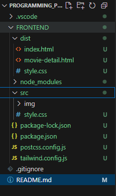

# Plataforma de E-commerce
Caso de Estudio: Desarrollo de una plataforma web e-commerce y despliegue en Amazon Web Service (AWS).
Este proyecto es una plataforma de Ecommerce enfocada en la compra y administración de películas y series. Permite a los usuarios explorar diferentes títulos, ver detalles de cada película y realizar compras. Además, los administradores pueden editar información de los productos. Este proyecto está construido de la siguiente manera:
    HTML y Tailwind CSS para el frontend.

#Estructura del proyecto

✅ Menú lateral interactivo con opciones de navegación.
✅ Navbar con perfil de usuario e imagen.
✅ Página principal con listado de películas.
✅ Página de detalles de la película con botones de compra y edición.

