# Plataforma de E-commerce
Caso de Estudio: Desarrollo de una plataforma web e-commerce y despliegue en Amazon Web Service (AWS).
Este proyecto es una plataforma de Ecommerce enfocada en la compra y administración de películas y series. Permite a los usuarios explorar diferentes títulos, ver detalles de cada película y realizar compras. Además, los administradores pueden editar información de los productos. Este proyecto está construido de la siguiente manera:
    HTML y Tailwind CSS para el frontend.

## Estructura del proyecto

✅ Página para inicio de sesión.
✅ Página para registrarse.
✅ Menú lateral interactivo con opciones de navegación.
✅ Navbar con perfil de usuario e imagen.
✅ Página principal con listado de películas.
✅ Página de detalles de la película con botones de compra y edición.

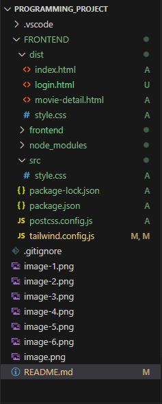

## Tecnologias del Proyecto
Lenguajes de Programación: HTML5, Javascript
Frameworks: Vite con React
Estilos: Tailwind Css

## Descripción

Esta es la página de inicio, cuenta con un login, un botón para registrarse y si se le olvida la contraseña.

Aqui se muestra un ejemplo de la validación del login

Validacion en el correo

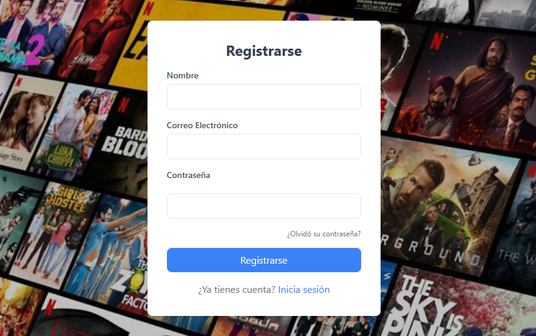
Se muestra el formulario de Registro.

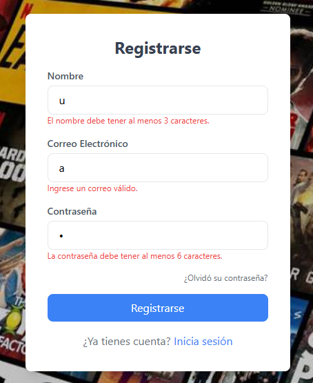
Y las validaciones en el mismo formulario

A continuación se muestran fotos de la aplicación hasta el momento

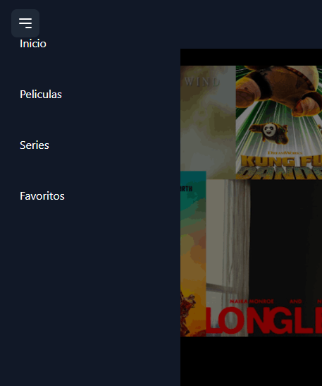

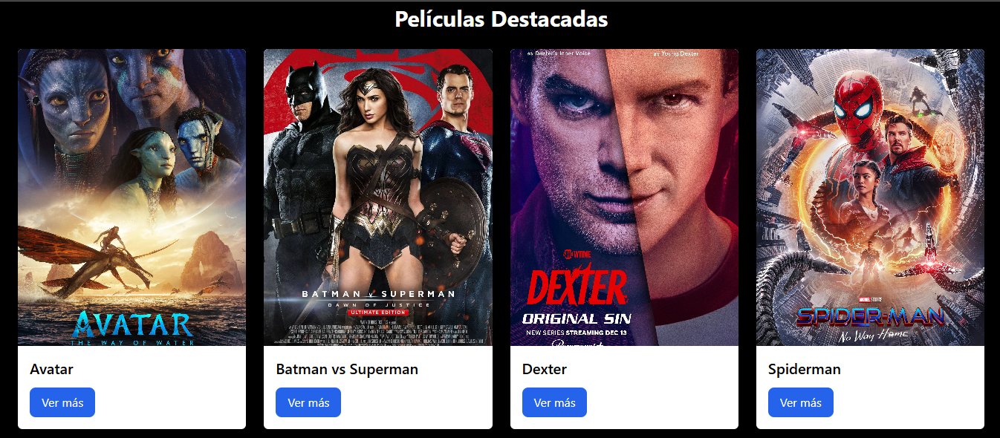

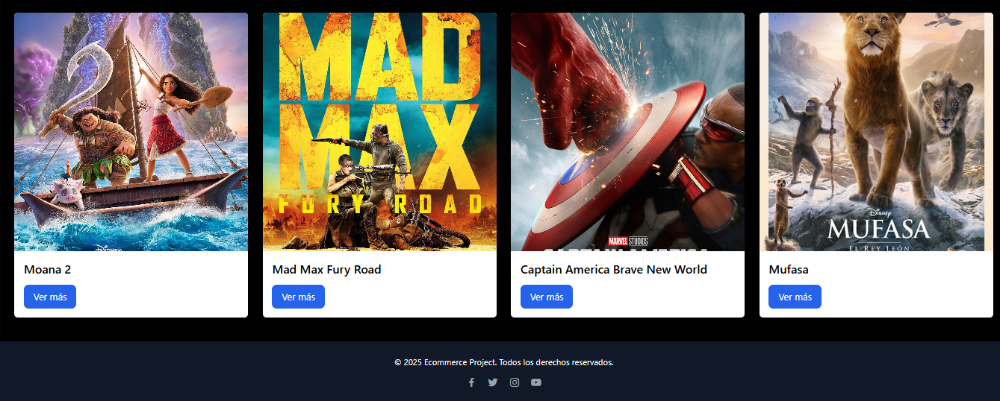

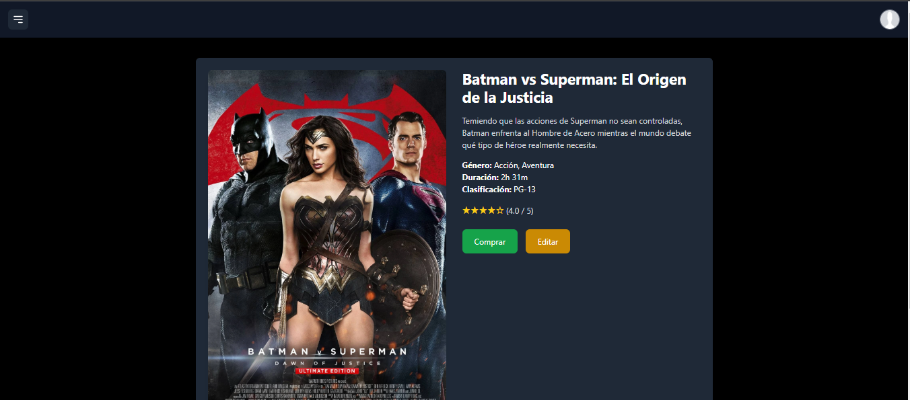

Comando para instalar react Router y asi convertir el frontend en un SPA
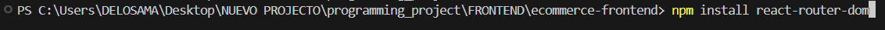

Se agregó un folder de routes y dentro de esta se creo un archivo routes.jsx en donde se definen las rutas de la aplicacion
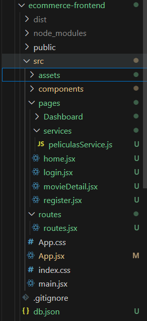
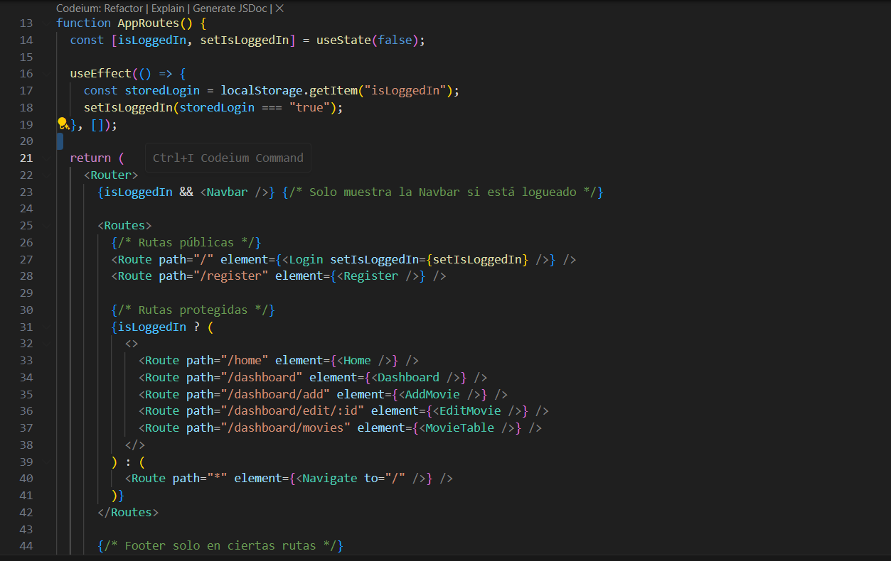

Para las rutas se creo un archivo privateRoutes para que el usuario pone una ruta en el buscador, este lo redigira al login.
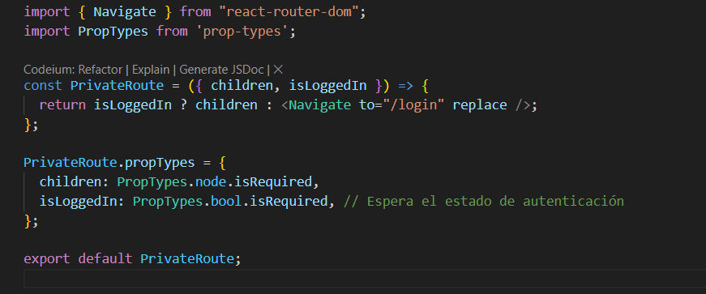

Las rutas principales en el proyecto son las siguientes:

/login: Página de inicio de sesión.
/home: Página principal de la aplicación.
/movies/:id: Detalles de una película específica.
/dashboard: Panel de control (requiere autenticación).
/add-movie: Página para agregar una nueva película (requiere autenticación).
/edit-movie/:id: Página para editar una película existente (requiere autenticación).

Tambien se creo un archivo db.json para manejar los datos de las peliculas, la cual utiliza http://localhost:3000/movies
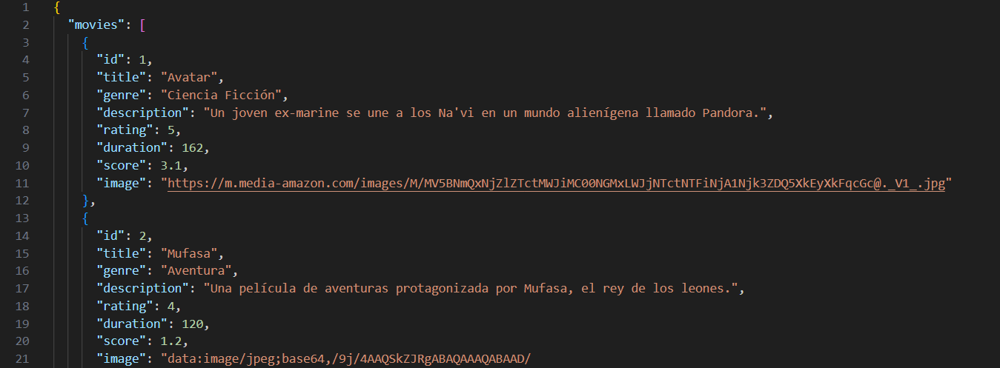

La cual consume el siguiente servicio peliculasService.js, en donde por el momento tenemos GetMovies, GetMovieById y updateMovie
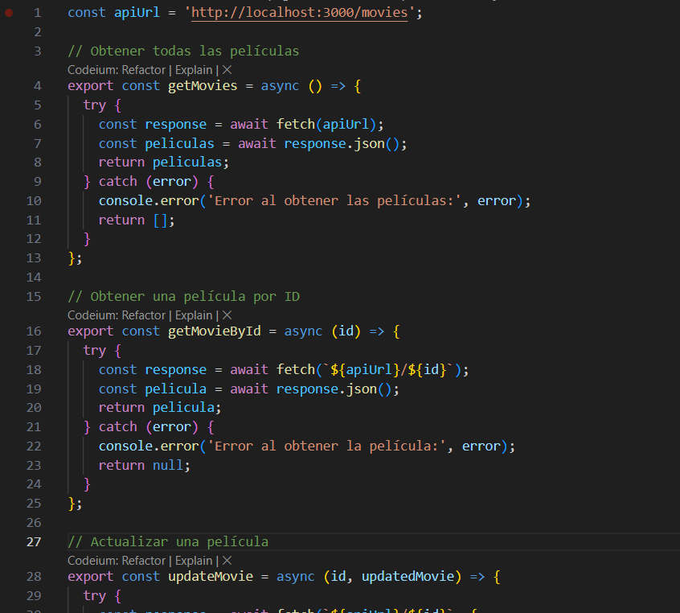

## Backend

Se creo una carpeta dentro del proyecto para manejar el backend, en este caso utilice MongoDB como mi gestor de Base de Datos, Node.js y Express.

Primero inicializamos el proyecto con node.js, lo cual genero el archivo package.json
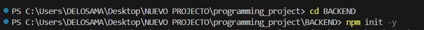

Luego instalamos las dependencias e instalamos nodemon para reiniciar el servidor en cambios automáticamente
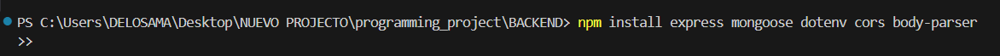

Para configurar el servidor con Express, cree un archivo server.js

Luego configure las variables de entorno creando un archivo llamado .env, en donde tengo el usuario y contraseña de mi base de datos.

Este es mi backend hasta el momento
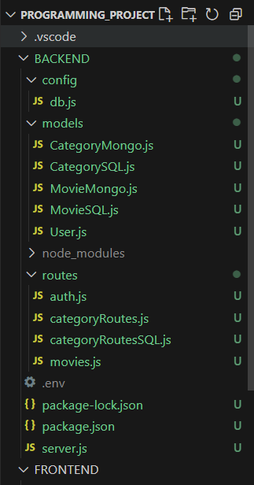
Se agregaron models, routes, el servidor

Luego de que se configuro todo, entre a postman y agregue Categorias, Usuarios y Peliculas

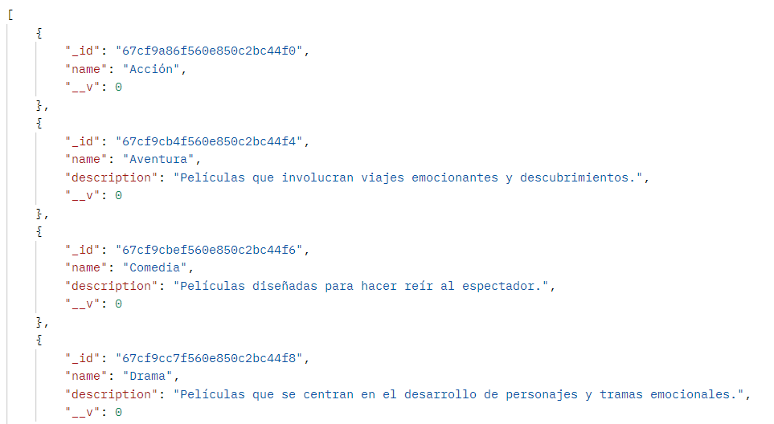
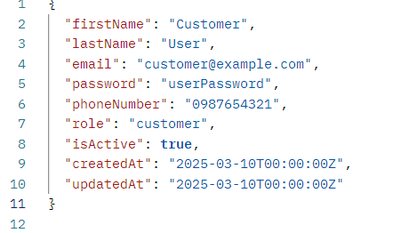
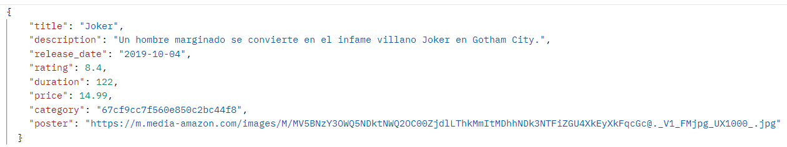

###Integración y Seguridad
Se agregaron unos middleware para auth y verificar el token

Y un generador de token con JWS, tambien en el archivo .env se agrego un SECRET KEY

En el frontend se creo otro archivo .env con la ruta del backend

Se crearon varios archivos en el front para integrar el frontend con el backend

Se crearon dos servicios apiClient y authServices
* ApiClient

* authService

Aqui un ejemplo iniciando sesion

## Desarrollo del Chatbot

Primero nos registramos en OpenAI y generamos una nueva clave para guardarla en el proyecto

Instalamos la biblioteca de OpenAI en el backend del proyecto

Creamos un asistente en Open IA y escribimos las instrucciones de este

Tambien agregamos varias funciones para:
* Buscar la informacion sobre una pelicula
* Buscar las peliculas por género
* Buscar peliculas por precio

Creamos el archivo para manejar OpenAI

Luego creamos un Endpoint en el backend

Asi es como responde desde OpenAI

Asi responde la IA desde la aplicación

