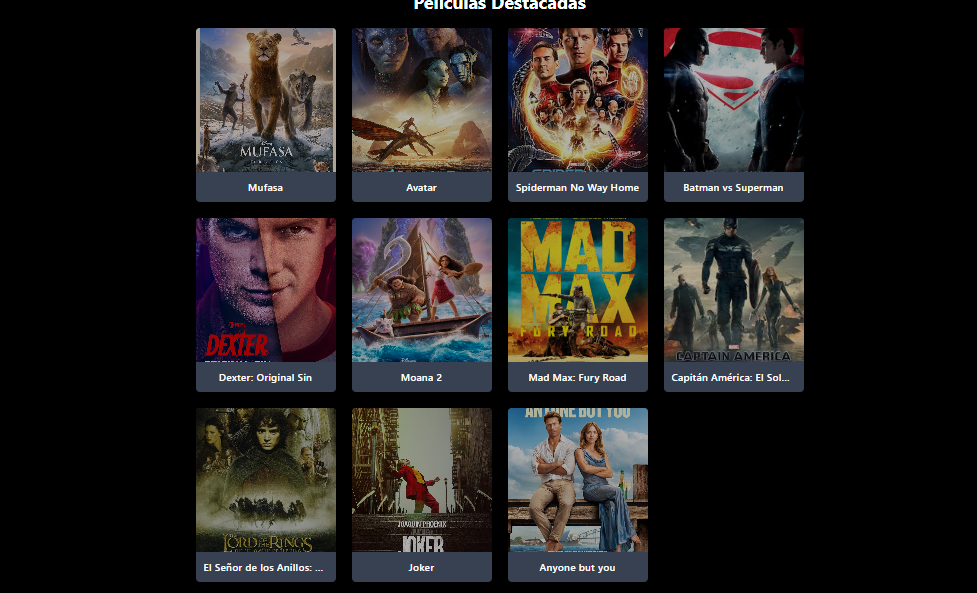
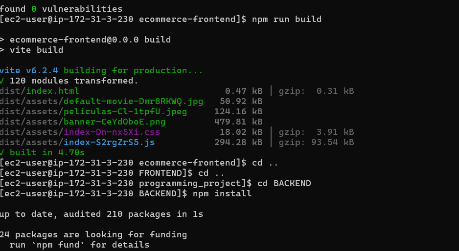

# Plataforma de E-commerce

Caso de Estudio: Desarrollo de una plataforma web e-commerce y despliegue en Amazon Web Service (AWS).
Este proyecto es una plataforma de Ecommerce enfocada en la compra y administración de películas y series. Permite a los usuarios explorar diferentes títulos, ver detalles de cada película y realizar compras. Además, los administradores pueden editar información de los productos. Este proyecto está construido de la siguiente manera:
    HTML, Tailwind CSS, Vite + React con Javascript para el frontend.
    Express, Node.js, JWT para el backend.
    MongoDB y PostgreSQL para las base de datos.

## Tabla de Contenidos

- [Instalación](#instalación)
- [Estructura del Proyecto](#estructura-del-proyecto)
- [Tecnologías Utilizadas](#tecnologias-utilizadas)
- [Descripción del Proyecto](#descripcion-del-proyecto)
- [Integración y Seguridad](#integracion-y-seguridad)
- [Chatbot](#chatbot)
- [Despliegue en AWS](#despliegue-en-aws)

## Instalación
1. **Clonar el Repositorio**:
   git clone https://github.com/patriciamadera/programming_project.git
   programming_project

2. **Instalar dependencias**:
    * Para el backend:
    cd BACKEND
    npm install

    * Para el frontend:
    cd FRONTEND
    cd ecommerce-frontend
    npm install

3. **Ejecución del sistema**:
    * Para el backend:
    npm run dev

    * Para el frontend:
    npm run dev

## Estructura del Proyecto
  

## Tecnologías Utilizadas
- Frontend:
    * React
    * Redux (o Context API)
    * React Router
    * Axios
    * TailwindCSS
- Backend:
    * Node.js
    * Express.js
    * MongoDB
    * PostgreSQL
    * Mongoose
    * JWT (JSON Web Tokens)
- Otros:
    * Git
    * npm 

## Descripción del Proyecto
MovieEcommerce es una aplicación web completa que permite a los usuarios comprar películas en línea y a los administradores les permite Crear, Editar, Eliminar las películas. 
El proyecto incluye un frontend desarrollado con React con Javascript y un backend desarrollado con Node.js y Express.js. 
La base de datos utilizada es MongoDB.

Esta es la página de inicio, cuenta con un login, un botón para registrarse y si se le olvida la contraseña.

Aqui se muestra un ejemplo de la validación del login

Validacion en el correo

Se muestra el formulario de Registro.

Y las validaciones en el mismo formulario

Parte del home de la aplicación

Menú del usuario, donde se ve la Cuenta, Configuración y Cerrar Sesión.

Navbar con todas las rutas de la aplicación.

Grid con todas las películas visibles para los usuarios/clientes.

Detalle de las películas, en donde sale la portada, descripció, precio, botón para comprar, entre otros.

Modal para Comprar una película en la cual sale el nombre de la película y el precio.

Dashboard para los administradores, en donde se muestra el listado de todas las peliculas que se han creado.

Página para agregar las películas

Página para editar una película ya agregada, aqui un ejemplo de una de las películas que cree.

## Integración y Seguridad
Se agregaron unos middleware para auth y verificar el token

Y un generador de token con JWS, tambien en el archivo .env se agrego un SECRET KEY

En el frontend se creo otro archivo .env con la ruta del backend

Se crearon varios archivos en el front para integrar el frontend con el backend

Se crearon dos servicios apiClient y authServices
* ApiClient

* authService

Aqui un ejemplo iniciando sesion

## Chatbot

Primero nos registramos en OpenAI y generamos una nueva clave para guardarla en el proyecto

Instalamos la biblioteca de OpenAI en el backend del proyecto

Creamos un asistente en Open IA y escribimos las instrucciones de este

Tambien agregamos varias funciones para:
* Buscar la informacion sobre una pelicula
* Buscar las peliculas por género
* Buscar peliculas por precio

Creamos el archivo para manejar OpenAI

Luego creamos un Endpoint en el backend

Asi es como responde desde OpenAI

Asi responde la IA desde la aplicación

## Despliegue a AWS
Se crea una instancia EC2 en AWS y se configura 

Se configuraron los puertos

Abrimos la terminal e instalamos las dependencias que se necesitan para poder correr el proyecto, como MongoDB y PostgreSQL

Aqui corrimos el frontend

Reiniciando el servidor en el backend

Aqui ya el servidor funcionando

Ya aqui mi aplicacion esta funcionando con mi IP

